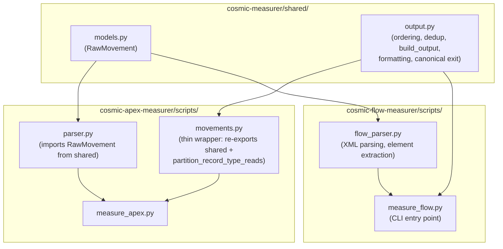

# COSMIC Flow Measurer - Phase 3 Implementation Plan

## Architecture

The Flow measurer follows the same pattern as the Apex measurer but parses XML instead of source code. A shared module will be extracted first to avoid duplicating ordering, dedup, and output logic.




## Directory Structure

```
cosmic-measurer/
├── shared/
│   ├── __init__.py
│   ├── models.py           # RawMovement dataclass (extracted from parser.py)
│   └── output.py           # Parameterized: order_movements, build_output, formatting
├── cosmic-apex-measurer/   # (existing, imports updated)
│   ├── scripts/
│   │   ├── parser.py       # imports RawMovement from shared.models
│   │   └── movements.py    # thin wrapper: re-exports shared + RecordType exclusion
│   └── tests/              # unchanged, still pass
└── cosmic-flow-measurer/
    ├── SKILL.md
    ├── PYTHON_DESIGN.md
    ├── requirements-dev.txt
    ├── .coveragerc
    ├── scripts/
    │   ├── __init__.py
    │   ├── flow_parser.py  # XML parsing, flow type detection, element extraction
    │   └── measure_flow.py # CLI: measure file, output JSON/table
    └── tests/
        ├── conftest.py
        ├── test_flow_parser.py      # ~35 unit tests for XML parsing
        ├── test_flow_movements.py   # ~12 tests for ordering/output via shared
        ├── test_measure_flow.py     # ~8 regression/integration tests
        └── test_measure_flow_cli.py # ~10 CLI tests
```

---

## Part 1: Extract Shared Module

Move generic logic out of the Apex measurer into `cosmic-measurer/shared/`.

### shared/models.py

Extract `RawMovement` from `[parser.py](.cursor/skills/cosmic-measurer/cosmic-apex-measurer/scripts/parser.py)` (lines 19-27):

```python
@dataclass
class RawMovement:
    movement_type: str   # E, R, W, X
    data_group_ref: str
    name: str
    order_hint: int
    source_line: Optional[int] = None
    execution_order: Optional[int] = None
    via_artifact: Optional[str] = None  # generic: class name (Apex), subflow name (Flow), etc.
```

**Rename: `via_class` -> `via_artifact`** -- The Apex measurer currently uses `via_class` to track movements inherited from traversed callee classes. In the shared model this becomes `via_artifact` since the concept (movement inherited from an external artifact) applies to any artifact type. The Apex parser sets it to the class name; the Flow measurer will set it to the subflow API name when subflow traversal is added. The JSON output key also changes from `viaClass` to `viaArtifact` for consistency. The Apex measurer's existing tests and `_traverse_callees` will be updated to use the new field name.

### shared/output.py

Extract from `[movements.py](.cursor/skills/cosmic-measurer/cosmic-apex-measurer/scripts/movements.py)` and parameterize:

- `order_movements()` -- unchanged
- `to_json_movement(m, order, merged_from, implementation_type)` -- new `implementation_type` param (was hardcoded `"apex"`). Emits `viaArtifact` key (renamed from `viaClass`)
- `build_output(artifact_type, artifact_name, movements, fp_id, implementation_type)` -- new `artifact_type` param (was hardcoded `"Apex"`)
- `to_json_string`, `to_human_summary`, `to_table`, `count_movement_types` -- unchanged
- Constants: `TYPE_ORDER`, `CANONICAL_EXIT_NAME`, `CANONICAL_EXIT_DATA_GROUP_REF`
- TypedDicts: `ArtifactDict`, `DataMovementRow`, `CosmicMeasureOutput`, etc.

### Apex measurer updates

- `[parser.py](.cursor/skills/cosmic-measurer/cosmic-apex-measurer/scripts/parser.py)`: `from shared.models import RawMovement` (with try/except fallback). Rename all `via_class=` usages to `via_artifact=`.
- `[movements.py](.cursor/skills/cosmic-measurer/cosmic-apex-measurer/scripts/movements.py)`: becomes thin wrapper that re-exports from `shared.output`, keeps `partition_record_type_reads` (Apex-only), wraps `build_output` to inject RT exclusion and default `artifact_type="Apex"`, `implementation_type="apex"`. Update `to_json_movement` to emit `viaArtifact` instead of `viaClass` in JSON output.
- `[measure_apex.py](.cursor/skills/cosmic-measurer/cosmic-apex-measurer/scripts/measure_apex.py)`: add `shared/` parent to sys.path. Rename `m.via_class` references to `m.via_artifact`.
- `[conftest.py](.cursor/skills/cosmic-measurer/cosmic-apex-measurer/tests/conftest.py)`: add cosmic-measurer/ to sys.path
- **Update all Apex tests**: rename `via_class` -> `via_artifact`, `viaClass` -> `viaArtifact` in assertions
- **Run all Apex tests** to confirm zero regressions

---

## Part 2: Flow Parser Foundation + Reads + Writes

### XML Parsing Strategy

Flow XML uses namespace `http://soap.sforce.com/2006/04/metadata`. Use `xml.etree.ElementTree` (stdlib). Define namespace map:

```python
NS = {"sf": "http://soap.sforce.com/2006/04/metadata"}
```

### flow_parser.py -- Core Functions

**Flow metadata:**

- `parse_flow(xml_path) -> FlowMetadata` -- parse XML, extract all metadata
- `extract_flow_name(root) -> str` -- from `<label>` or filename
- `extract_process_type(root) -> str` -- from `<processType>` (Flow, AutolaunchedFlow, etc.)
- `extract_api_version(root) -> str` -- from `<apiVersion>`

**Reads (recordLookups):**

- `find_record_lookups(root) -> list[RawMovement]`
- Each `<recordLookups>` has `<object>` (SObject API name), `<name>`, `<label>`
- Creates one R movement per lookup with `dataGroupRef = <object>` value

From the [sample flow](samples/cfp_createCRUDLwithRelatedLists.flow-meta.xml), the pattern is:

```xml
<recordLookups>
    <name>getFunctionalProcess</name>
    <object>cfp_FunctionalProcess__c</object>
    ...
</recordLookups>
```

**Writes (recordCreates / recordUpdates / recordDeletes):**

- `find_record_mutations(root, variables) -> list[RawMovement]`
- `<recordCreates>`: has `<object>` directly, OR `<inputReference>` pointing to a variable
- `<recordUpdates>`, `<recordDeletes>`: same pattern
- When `<object>` is absent, resolve from `<inputReference>` by looking up the variable's `<objectType>`:

```xml
<recordCreates>
    <name>createDMs</name>
    <inputReference>DMsToInsert</inputReference>  <!-- no <object> -->
</recordCreates>
<variables>
    <name>DMsToInsert</name>
    <objectType>cfp_Data_Movements__c</objectType>
</variables>
```

- Creates one W movement per mutation element
- Write dedup handled by `shared/output.py`'s `order_movements`

**Variable resolution:**

- `extract_variables(root) -> dict[str, VariableInfo]` -- map variable name to its type/objectType
- Used for inputReference resolution and Entry/Exit detection

### implementationType

All flow-derived movements use `implementationType: "flow"` (new value). Update `[reference.md](.cursor/skills/cosmic-measurer/reference.md)` to include `flow` in the allowed values.

---

## Part 3: Entries and Exits

### Entry (E) -- Flow-type aware


| processType                                             | Entry Source                                                 | dataGroupRef                          |
| ------------------------------------------------------- | ------------------------------------------------------------ | ------------------------------------- |
| `Flow` (Screen)                                         | Input variables with `isInput=true` and SObject `objectType` | Variable's `objectType`               |
| `AutolaunchedFlow`                                      | Input variables with `isInput=true`                          | Variable's `objectType` or `dataType` |
| Record-Triggered (`start` has `triggerType` + `object`) | Triggering record                                            | Start element's `object`              |
| `Schedule`                                              | Scheduled query criteria                                     | Start element's `object`              |
| Platform Event                                          | Event subscription                                           | Start element's `object`              |


From the [sample flow](samples/cfp_createCRUDLwithRelatedLists.flow-meta.xml):

```xml
<variables>
    <name>recordId</name>
    <dataType>String</dataType>
    <isInput>true</isInput>
</variables>
```

- `recordId` with `dataType: String` is a common pattern for record context. Infer object from the first `recordLookup` that filters by `Id = {!recordId}`, or use `"Unknown"` / skip primitives.

**Rules:**

- SObject input variables -> E with `dataGroupRef = objectType`
- String/Id `recordId` input -> E, infer object from usage (first lookup filtering by it)
- Primitive inputs (String, Boolean, Number) that are not `recordId` -> skip (not data groups)
- Record-triggered: `<start>` has `<object>` and `<triggerType>` -> E with that object

### Exit (X)

- Output variables (`isOutput=true`) with SObject type -> X
- Canonical `Errors/notifications` -> X (always last, via `shared/output.py`)
- Screens are **deferred to Part 5**

---

## Part 4: CLI + Golden File Regression

### measure_flow.py CLI

Mirror the Apex measurer's CLI pattern:

```bash
# Basic measurement
python3 measure_flow.py path/to/Flow.flow-meta.xml

# JSON output
python3 measure_flow.py Flow.flow-meta.xml --json

# Write to file
python3 measure_flow.py Flow.flow-meta.xml -o output.json

# With FP ID
python3 measure_flow.py Flow.flow-meta.xml --fp-id 001xxx
```

Flags: `-o`, `--fp-id`, `--json` (same as Apex). No `--entry-point` needed (flows are single-process). No `--search-paths` (no callee traversal for flows).

### Golden file for sample flow

Create `expected/cfp_createCRUDLwithRelatedLists.expected.json` with the expected measurement of the [sample flow](samples/cfp_createCRUDLwithRelatedLists.flow-meta.xml).

Expected movements for the sample (Screen Flow measuring COSMIC itself):

- **E**: `recordId` input variable (inferred: `cfp_FunctionalProcess__c` from first lookup filter)
- **R**: `getFunctionalProcess` (cfp_FunctionalProcess__c), `getDatagroups` (cfp_DataGroups__c)
- **W**: `createDMs` (cfp_Data_Movements__c)
- **X**: Canonical `Errors/notifications` (status/errors/etc)

Screens are deferred -- they won't produce movements until Part 5.

---

## Part 5: Screens (Deferred -- Later Iteration)

Screens are complex because they serve dual COSMIC roles:

**Screen as Exit (X) -- displaying data to user:**

- `<fields>` with `fieldType: DisplayText` that reference record data
- Datatable components showing query results
- Treat each screen that displays SObject data as one X per data group displayed

**Screen as Entry (E) -- receiving data from user:**

- `<fields>` with `fieldType: InputField` on SObject fields
- Component instances with input parameters bound to SObject records

**Design decision (to resolve during implementation):**

- One movement per screen (coarse) vs one per distinct data group on screen (fine-grained)
- How to determine `dataGroupRef` from screen field references
- Whether display-only screens (like `confirmSelections`) count as X

---

## Part 6: Flow Type Special Cases (Deferred -- Later Iteration)

### Record-Triggered Flows

- `<start>` element has `<triggerType>` (RecordBeforeSave, RecordAfterSave, RecordBeforeDelete) and `<object>`
- **Before-save**: the save itself is an implicit W to the trigger object (the platform writes the record)
- **After-save**: only explicit `recordCreates`/`recordUpdates`/`recordDeletes` count as W
- Entry is always the trigger record

### Scheduled Flows

- `<start>` element defines query criteria and `<object>`
- Implicit R: the platform queries records matching criteria
- Entry: the scheduled batch of records

### Platform Event Flows

- `<start>` element references the platform event object
- Entry: the event record

### Subflows (actionCalls to other flows)

- `<actionCalls>` with `actionType: Flow` invoke subflows
- Similar to Apex callee traversal: could merge R/W from subflows
- Deferred to a future iteration

---

## Test Plan (Extensive)

### Synthetic XML Fixtures (in conftest.py / inline)

Each fixture is a minimal `.flow-meta.xml` string testing one concern:


| Fixture                   | processType      | Elements                                              | Tests               |
| ------------------------- | ---------------- | ----------------------------------------------------- | ------------------- |
| `minimal_screen_flow`     | Flow             | 1 recordLookup, 1 recordCreate                        | Basic R + W         |
| `multi_lookup_flow`       | Flow             | 3 recordLookups (2 same object)                       | Read dedup          |
| `all_mutations_flow`      | Flow             | recordCreate + recordUpdate + recordDelete (same obj) | Write dedup         |
| `different_objects_flow`  | Flow             | recordCreate (A) + recordUpdate (B)                   | No dedup            |
| `input_reference_flow`    | Flow             | recordCreate with inputReference                      | Variable resolution |
| `input_output_vars_flow`  | AutolaunchedFlow | isInput + isOutput SObject vars                       | E + X               |
| `record_triggered_flow`   | AutolaunchedFlow | start with triggerType + object                       | Trigger E           |
| `scheduled_flow`          | Schedule         | start with object + scheduledPaths                    | Scheduled E + R     |
| `empty_flow`              | Flow             | no elements                                           | Only canonical X    |
| `screen_with_inputs_flow` | Flow             | screen with InputField + DisplayText                  | Screen E/X          |
| `no_namespace_flow`       | (none)           | Missing namespace                                     | Error handling      |


### test_flow_parser.py (~35 tests)

**Metadata extraction:**

- `test_extract_flow_name_from_label`
- `test_extract_flow_name_fallback_to_filename`
- `test_extract_process_type_screen_flow` (processType = "Flow")
- `test_extract_process_type_autolaunched`
- `test_extract_process_type_record_triggered` (has triggerType in start)
- `test_extract_api_version`
- `test_extract_flow_status`

**Reads:**

- `test_find_reads_single_record_lookup`
- `test_find_reads_multiple_lookups`
- `test_find_reads_extracts_object_name`
- `test_find_reads_extracts_label_as_name`
- `test_find_reads_get_first_record_only_metadata`
- `test_find_reads_none_present_returns_empty`
- `test_find_reads_from_sample_flow` (cfp_FunctionalProcess__c + cfp_DataGroups__c)

**Writes:**

- `test_find_writes_record_create_with_object`
- `test_find_writes_record_create_with_input_reference`
- `test_find_writes_record_update_with_object`
- `test_find_writes_record_update_with_input_reference`
- `test_find_writes_record_delete`
- `test_find_writes_none_present_returns_empty`
- `test_find_writes_unresolvable_input_reference`
- `test_find_writes_from_sample_flow` (cfp_Data_Movements__c)

**Variables:**

- `test_extract_variables_input`
- `test_extract_variables_output`
- `test_extract_variables_input_output`
- `test_extract_variables_with_object_type`
- `test_extract_variables_primitive_types`

**Entries:**

- `test_find_entries_from_input_variables`
- `test_find_entries_skips_primitive_non_record_id`
- `test_find_entries_record_triggered_from_start`
- `test_find_entries_record_id_infers_object`

**Exits:**

- `test_find_exits_from_output_variables`
- `test_find_exits_empty_when_no_outputs`

**Error handling:**

- `test_parse_empty_xml_raises`
- `test_parse_invalid_xml_raises`
- `test_parse_non_flow_root_raises`

### test_flow_movements.py (~12 tests)

Uses `shared/output.py` directly with flow-specific inputs:

- `test_order_movements_e_r_w_x_order`
- `test_write_dedup_same_object`
- `test_write_no_dedup_different_objects`
- `test_canonical_exit_appended_last`
- `test_canonical_exit_with_no_other_exits`
- `test_build_output_artifact_type_is_flow`
- `test_build_output_implementation_type_is_flow`
- `test_build_output_json_schema_matches_reference`
- `test_count_movement_types_flow`
- `test_to_human_summary_flow`
- `test_to_table_flow`
- `test_to_json_string_roundtrip`

### test_measure_flow.py (~8 tests)

- `test_measure_sample_flow_reads_detected` (expects R for cfp_FunctionalProcess__c + cfp_DataGroups__c)
- `test_measure_sample_flow_writes_detected` (expects W for cfp_Data_Movements__c)
- `test_measure_sample_flow_entry_detected` (expects E for recordId)
- `test_measure_sample_flow_canonical_exit_is_final`
- `test_measure_sample_flow_golden_file` (full regression against expected JSON)
- `test_measure_minimal_flow`
- `test_measure_empty_flow_only_canonical_exit`
- `test_measure_flow_with_dedup`

### test_measure_flow_cli.py (~10 tests)

- `test_cli_json_stdout`
- `test_cli_table_stdout`
- `test_cli_output_file`
- `test_cli_fp_id`
- `test_cli_missing_file`
- `test_cli_non_xml_warning`
- `test_cli_invalid_xml_error`
- `test_cli_multiple_files`
- `test_cli_multiple_files_output`
- `test_cli_help`

---

## Implementation Order

Incremental, testable steps matching "Reads/Writes first, Screens later":

1. **Shared module extraction** -- extract, update Apex imports, verify Apex tests pass
2. **Flow scaffold** -- directory structure, SKILL.md, PYTHON_DESIGN.md, conftest.py
3. **XML foundation** -- namespace handling, metadata extraction, test fixtures
4. **Reads** -- recordLookups parsing + unit tests
5. **Writes** -- recordCreates/Updates/Deletes + variable resolution + unit tests
6. **CLI + basic integration** -- measure_flow.py, test against sample
7. **Entries** -- input variables, flow-type-aware entry detection + tests
8. **Exits + canonical** -- output variables, canonical exit + tests
9. **Golden file** -- create expected JSON, regression test
10. **Update reference.md** -- add `flow` to implementationType
11. **Screens** -- later iteration
12. **Flow type special cases** -- later iteration

