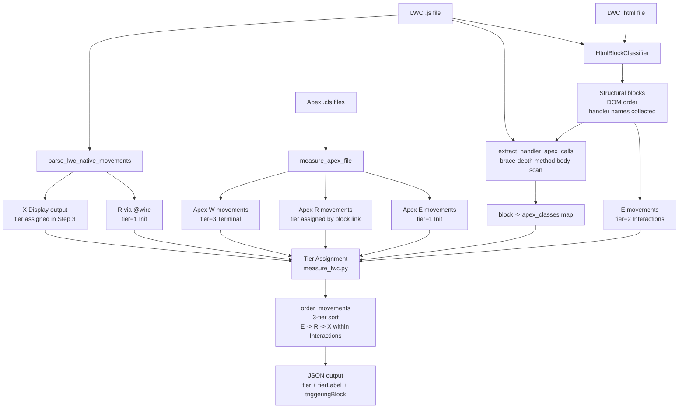

# LWC Human-Ordered COSMIC Measurement

## What changes and why

Current state: one generic `"Receive user interaction"` E is emitted for any number of event handlers; `order_movements()` in `shared/output.py` sorts flat by `TYPE_ORDER = {"E":0,"R":1,"W":2,"X":3}`, producing an E-then-R-then-W-then-X block regardless of interaction flow.

Target state: HTML is parsed into structural blocks, each block emits a semantically named E, and movements are ordered by a **generic 3-tier model** that works for any LWC — not a hardcoded 5-phase map derived from one specific component.

---

## Why not hardcoded phases

A fixed 5-phase model (Load → Filter → Row Editing → Pagination → Save) overfits AddSORs. Other component shapes (wizards, search-detail, simple forms, read-only visualisers) don't have those phases. The block classifier labels come from what the HTML actually contains — they are not assumed in advance.

---

## Key files

- `[shared/models.py](.cursor/skills/cosmic-measurer/shared/models.py)` — `RawMovement` dataclass
- `[cosmic-lwc-measurer/scripts/lwc_parser.py](.cursor/skills/cosmic-measurer/cosmic-lwc-measurer/scripts/lwc_parser.py)` — HTML parsing and E detection
- `[shared/output.py](.cursor/skills/cosmic-measurer/shared/output.py)` — `order_movements()`, output schema, `DataMovementRowOptional`
- `[cosmic-lwc-measurer/scripts/measure_lwc.py](.cursor/skills/cosmic-measurer/cosmic-lwc-measurer/scripts/measure_lwc.py)` — orchestration and tier assignment
- `[expected/cfp_FunctionalProcessVisualiser.lwc.expected.json](expected/cfp_FunctionalProcessVisualiser.lwc.expected.json)` — golden file (must be regenerated)
- `[cosmic-lwc-measurer/tests/test_lwc_parser.py](.cursor/skills/cosmic-measurer/cosmic-lwc-measurer/tests/test_lwc_parser.py)` — unit tests for parser
- `[cosmic-lwc-measurer/tests/test_measure_lwc.py](.cursor/skills/cosmic-measurer/cosmic-lwc-measurer/tests/test_measure_lwc.py)` — integration tests

---

## The 3-tier generic model


| Tier | Contents | Ordering |
|---|---|---|
| **1 — Init** | `@wire` R movements + Apex R movements called from `connectedCallback` + Apex E (method params) | By `order_hint` / source line |
| **2 — Interactions** | One E-led cluster per detected HTML block; each cluster includes R movements whose Apex class is linked to that block's handlers | In DOM order; within each cluster: E → associated R(s) → display X (if this cluster first populates the view) |
| **3 — Terminal** | All W movements + canonical X (`Errors/notifications`) | Writes first, canonical X last |

The display X (`"Display LWC output to user"`) sits at the end of the **first Interactions cluster that has an associated R** — expressing that the view is populated after that interaction fires, not at load. For read-only components with no interaction blocks, it falls back to the end of Init.

---

## Step 1 — Extend `RawMovement` (`shared/models.py`)

**RED first:** Write tests asserting the four new fields exist with correct defaults before touching the dataclass.

Add four fields:

```python
tier: Optional[int] = None              # 1=Init, 2=Interactions, 3=Terminal
tier_label: Optional[str] = None        # "Init", "Interactions", "Terminal"
block_label: Optional[str] = None       # for E movements: the block classification name
triggering_block: Optional[str] = None  # for R/X in Interactions: which block's E triggered this read
```

**Suite check:** All existing tests still pass — these are additive optional fields with `None` defaults.

---

## Step 2 — HTML block classifier (`lwc_parser.py`)

**RED first:** Write one test per block type in `test_lwc_parser.py` before implementing — each test passes a minimal HTML snippet and asserts the expected `block_label`, E name, data group, and handler method names. Also assert existing `test_parse_lwc_native_movements_detects_partial_types` (no event handlers → no E) still holds.

Replace `_TEMPLATE_EVENT_RE` single-E detection with `HtmlBlockClassifier` using Python's built-in `html.parser.HTMLParser`.

Build a lightweight element tree. Walk the tree and collect **structural containers** that have at least one event handler (`on`* attribute) anywhere inside them. For each such container, emit one `RawMovement(type="E")`.

Block name and data group are derived by inspecting what the container holds:


| What the container contains                                                       | Derived E name               | Derived data group |
| --------------------------------------------------------------------------------- | ---------------------------- | ------------------ |
| `for:each` with event handlers on row elements                                    | `"Receive row edits"`        | `"RowData"`        |
| `<input type="checkbox">` with `onclick`/`onchange` outside `for:each`            | `"Receive select-all"`       | `"RowSelection"`   |
| `oncustomlookupupdateevent` handlers or search `lightning-input` with `onchange`  | `"Receive filter criteria"`  | `"FilterCriteria"` |
| `lightning-button` or `button` with `onclick` — label matches save/submit/confirm | `"Receive save command"`     | `"SaveCommand"`    |
| `lightning-button` with `onclick` — label matches previous/next/page              | `"Receive page navigation"`  | `"PageNavigation"` |
| Anything else                                                                     | `"Receive user interaction"` | `"User"`           |


- `block_label` is set to the classification key (`"row-edit"`, `"filter"`, `"save-command"`, etc.)
- `tier = 2`, `tier_label = "Interactions"` on all block E movements
- Each block also records its **handler method names** (collected from `on*` attribute values during tree walk) — used in Step 2.5 to link Apex classes to blocks
- **DOM order** is preserved: blocks are emitted in the order they appear in the HTML
- No block → no E emitted (correct for read-only components like `cfp_FunctionalProcessVisualiser`)

**Suite check:** `test_parse_lwc_native_movements_detects_all_types` must be updated to expect the new block-classified E (single `onclick` button → one E, `block_label="generic"` or `"save-command"`). All other existing tests must remain green before proceeding.

---

## Step 2.5 — JS handler→Apex call graph (`lwc_parser.py`)

**RED first:** Write tests for `extract_handler_apex_calls` before implementing — assert correct handler→class mapping, empty result when no Apex calls, multiple handlers mapping to same class, handler calling a helper that calls Apex (brace-depth must handle nested calls).

New function `extract_handler_apex_calls(js_source, apex_import_vars) → dict[str, list[str]]`.

Scans the JS for class method definitions, uses brace-depth counting to extract each method body, then checks which Apex import variable names are called within that body. Cross-references with `detect_apex_import_vars` (already exists, maps var→class name) to resolve to Apex class names.

Returns: `{ "handleFilterChange": ["AddSORController"], "handleSave": ["AddSORController", "WorkOrderLineItemTableController"] }`

The block classifier passes its collected handler method names to this function. The result is attached to each block as `apex_classes: list[str]` — the Apex classes whose R movements should be placed in that block's Interactions cluster rather than Init.

**Example for AddSORs:**
```
Block("filter") handlers: [handleComponentChange, handleComponentTypeChange, handleSubComponentChange, handleSearchChange]
  → apex_classes: ["AddSORController"]   ← Service_Catalogue__c R moves to Interactions

Block("save-command") handlers: [handleSave]
  → apex_classes: ["AddSORController", "WorkOrderLineItemTableController"]  ← W movements already Terminal
```

**Suite check:** All existing tests pass before proceeding.

---

## Step 3 — Tier assignment (`measure_lwc.py`)

**RED first:** Write integration tests in `test_measure_lwc.py` using synthetic bundles (tmp_path) before implementing — assert `@wire` R gets `tier=1`, an Apex R whose class is linked to a block handler gets `tier=2` with correct `triggeringBlock`, W gets `tier=3`, display X tier follows first interaction cluster with an R, canonical X is always `tier=3` and last.

After collecting all movements (native + merged Apex), using the block→apex_classes map from Step 2.5:

- `@wire` R movements → `tier=1, tier_label="Init"`
- Apex R movements whose class is **not** linked to any block → `tier=1, tier_label="Init"` (called from `connectedCallback` or load lifecycle)
- Apex R movements whose class **is** linked to a block → `tier=2, tier_label="Interactions"`, `triggering_block=<block_label>` (placed after that block's E in DOM order)
- E movements from block classifier → `tier=2, tier_label="Interactions"` (already set by classifier)
- `X "Display LWC output to user"` → `tier=2` on the first Interactions block that has associated R movements; `tier=1` if no block has associated R (read-only component fallback)
- `W` movements → `tier=3, tier_label="Terminal"`
- Canonical `X "Errors/notifications"` → `tier=3, tier_label="Terminal"` (always last)
- Apex-sourced E movements (method parameters) → `tier=1` (they fire as part of the load sequence)

**Suite check:** All existing tests pass before proceeding. The `test_measure_lwc_missing_apex_non_fatal` and `test_measure_lwc_apex_merge_has_via_artifact` tests are particularly important to verify here.

---

## Step 4 — Tier-aware ordering (`shared/output.py`)

**RED first:** Write tests for the new `order_movements()` sort behaviour — assert tier 1 before tier 2 before tier 3; within tier 2, DOM block order is preserved; within each block cluster, E → R → X; canonical X is always the last row regardless of other tier=3 movements.

Replace `TYPE_ORDER` sort key in `order_movements()`:

```python
# Primary: tier (1 → 2 → 3)
# Secondary within tier 1: Apex E → R by order_hint → display X (if no interaction-linked R)
# Secondary within tier 2: by DOM block order (order_hint); within each block: E → R → X
# Secondary within tier 3: W movements by order_hint, canonical X always last
```

Add `tier`, `tierLabel`, and `triggeringBlock` to `DataMovementRowOptional` (optional, backward-compatible).

**Suite check:** All existing tests pass. Note: `test_measure_lwc_sample_matches_golden` will now fail because the golden file is stale — this is expected and is resolved in the final step.

---

## Step 5 — Update `to_table()` (`shared/output.py`)

**RED first:** Write a test asserting `to_table()` output contains tier section headers (`### Init`, `### Interactions`, `### Terminal`) and that a component with no Interactions blocks omits that section.

Group output rows by `tierLabel` with a section header per tier. Components with no Interactions-tier movements (read-only) render only Init and Terminal sections.

**Suite check:** All tests except the golden file test pass.

---

## Step 6 — Regenerate golden file and full green suite

Re-run the measurer on `cfp_FunctionalProcessVisualiser` with `--json` and save the output as the new `expected/cfp_FunctionalProcessVisualiser.lwc.expected.json`. The component has no HTML event handlers so emits no block E; its Apex E gets `tier=1`, R gets `tier=1`, display X gets `tier=1` (no interaction-linked R → Init fallback).

**Full suite must be green** — including `test_measure_lwc_sample_matches_golden` — before the plan is considered complete.

---

## Data flow




