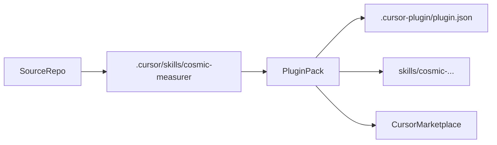

# Publish COSMIC Skill Pack

## Overview

Publish the existing COSMIC measurer family as an official Cursor plugin so users can install it through the Cursor-native plugin flow instead of cloning this repository and running skills from `.cursor/skills/`. The current repository should stay the source of truth for the measurer logic, while the published plugin becomes the installable distribution artifact.

## Problem Frame

The current skills are well-structured for in-repo use, but not yet packaged for official distribution:

- Skills live under `[.cursor/skills/cosmic-measurer/](.cursor/skills/cosmic-measurer/)`, while Cursor plugins expect a `skills/` tree plus `[.cursor-plugin/plugin.json](.cursor-plugin/plugin.json)` at the plugin root.
- Existing `SKILL.md` files and README examples hardcode repo-root paths such as `.cursor/skills/...`, which will not be correct after plugin installation.
- Shared Python helpers in `[.cursor/skills/cosmic-measurer/shared/](.cursor/skills/cosmic-measurer/shared/)` and some measurer scripts currently rely on the repository layout rather than a clean plugin-relative package layout.
- The repo has authoring and testing materials such as `[README.md](README.md)`, `[COUNTING_RULES.md](COUNTING_RULES.md)`, `[expected/](expected/)`, and `[samples/](samples/)`, but no release manifest, install docs for plugin users, or Marketplace submission workflow.

## Requirements Trace

- `R1` Package the existing Apex, Flow, FlexiPage, and LWC measurer skills as one installable Cursor plugin.
- `R2` Ensure each installed skill works from plugin-relative paths, without requiring the user to clone this repo or preserve the current `.cursor/skills/...` location.
- `R3` Preserve the existing COSMIC counting contract defined in `[.cursor/skills/cosmic-measurer/reference.md](.cursor/skills/cosmic-measurer/reference.md)` and `[COUNTING_RULES.md](COUNTING_RULES.md)`.
- `R4` Publish clear install and usage docs for plugin users, including local testing and Marketplace-ready metadata.
- `R5` Add a repeatable release verification flow before publication.

## Scope Boundaries

- Do not redesign COSMIC counting semantics or add new measurer types as part of packaging.
- Do not turn the Python code into a separate pip package in this phase unless plugin portability proves impossible without it.
- Do not treat `cosmic-layout-measurer` as required for first publication unless the skill is actually implemented.

## Context & Research

### Relevant Existing Assets

- Shared contract and schema: `[.cursor/skills/cosmic-measurer/reference.md](.cursor/skills/cosmic-measurer/reference.md)`
- Current skill implementations:
  - `[.cursor/skills/cosmic-measurer/cosmic-apex-measurer/SKILL.md](.cursor/skills/cosmic-measurer/cosmic-apex-measurer/SKILL.md)`
  - `[.cursor/skills/cosmic-measurer/cosmic-flow-measurer/SKILL.md](.cursor/skills/cosmic-measurer/cosmic-flow-measurer/SKILL.md)`
  - `[.cursor/skills/cosmic-measurer/cosmic-flexipage-measurer/SKILL.md](.cursor/skills/cosmic-measurer/cosmic-flexipage-measurer/SKILL.md)`
  - `[.cursor/skills/cosmic-measurer/cosmic-lwc-measurer/SKILL.md](.cursor/skills/cosmic-measurer/cosmic-lwc-measurer/SKILL.md)`
- Shared Python implementation: `[.cursor/skills/cosmic-measurer/shared/](.cursor/skills/cosmic-measurer/shared/)`
- Current repo-level usage docs: `[README.md](README.md)`
- Previous internal planning context: `[.cursor/plans/2026-03-23-cosmic_measurer_skills.plan.md](.cursor/plans/2026-03-23-cosmic_measurer_skills.plan.md)`

### External Guidance Incorporated

- Cursor's official packaged/public distribution unit is a plugin, not a standalone marketplace entry for raw `SKILL.md` folders.
- Plugin-bundled skills should reference helper files with paths relative to the skill root, such as `scripts/...` and `references/...`, instead of hardcoded workspace or install-cache paths.
- Manual repo/folder distribution can remain as a fallback, but the primary release shape for this plan is a Cursor plugin.

## Key Technical Decisions

- **Use a dedicated distributable plugin surface:** Treat this repository as the authoring source and produce a plugin-shaped artifact with `skills/` and `.cursor-plugin/` at the root. This can live either in a dedicated public plugin repo or in a publishable subdirectory exported from this repo, but the plan should optimize for a standalone public plugin repo because it gives the cleanest Marketplace story.
- **Normalize all skill references to plugin-relative paths:** Every packaged `SKILL.md` should reference bundled scripts and docs using `scripts/...`, `references/...`, and similar relative paths.
- **Ship only implemented skills in v1:** Publish Apex, Flow, FlexiPage, and LWC. Keep `cosmic-layout-measurer` out of the first public release until it is real.
- **Keep the Python runtime embedded in the plugin bundle for v1:** Repackage existing scripts and shared helpers into a plugin-safe layout before considering a separate Python package.

## Open Questions

### Resolved During Planning

- **Distribution target:** Official Cursor plugin / Marketplace path.
- **Primary packaging model:** Plugin-first, not manual skill-folder release.

### Deferred to Implementation

- **Single-repo vs separate plugin repo execution:** The plan recommends a dedicated public plugin repo, but the final operational choice can be made once the export/sync effort is understood.
- **How much test data ships in the public plugin:** Decide during packaging whether `[samples/](samples/)` and `[expected/](expected/)` are included fully, trimmed to minimal examples, or kept only in the source repo.
- **Branding assets:** Logo, keywords, and Marketplace copy can be finalized once the plugin manifest exists.

## High-Level Technical Design

> *This illustrates the intended approach and is directional guidance for review, not implementation specification. The implementing agent should treat it as context, not code to reproduce.*

## Implementation Units

- [ ] **Unit 1: Define the publishable plugin surface**

**Goal:** Decide exactly what files belong in the public plugin and what stays only in the source repo.

**Requirements:** `R1`, `R3`, `R4`

**Dependencies:** None

**Files:**
- Review: `[README.md](README.md)`
- Review: `[COUNTING_RULES.md](COUNTING_RULES.md)`
- Review: `[.cursor/skills/cosmic-measurer/reference.md](.cursor/skills/cosmic-measurer/reference.md)`
- Review: `[.cursor/skills/cosmic-measurer/](.cursor/skills/cosmic-measurer/)`
- Create or document target layout for: `skills/`, `.cursor-plugin/`, `README.md`, `LICENSE`

**Approach:**
- Inventory the four implemented skills and their support files.
- Separate runtime dependencies from authoring-only materials.
- Decide whether the distributable plugin is produced directly in this repo or exported into a dedicated public plugin repo.
- Freeze a v1 release boundary so packaging work does not expand into new measurer development.

**Patterns to follow:**
- Existing skill family layout under `[.cursor/skills/cosmic-measurer/](.cursor/skills/cosmic-measurer/)`
- Shared contract in `[.cursor/skills/cosmic-measurer/reference.md](.cursor/skills/cosmic-measurer/reference.md)`

**Test scenarios:**
- Happy path: the chosen plugin surface includes all runtime files needed by Apex, Flow, FlexiPage, and LWC skills.
- Edge case: incomplete/planned-only skill folders such as `cosmic-layout-measurer` are excluded from the v1 package.
- Integration: the chosen file layout still supports cross-skill traversal paths such as FlexiPage -> LWC and Flow -> Apex.

**Verification:**
- A reviewer can point to a concrete plugin tree and say which files ship, which files stay source-only, and why.

- [ ] **Unit 2: Make each skill plugin-portable**

**Goal:** Remove current assumptions that skills run from this repository's `.cursor/skills/...` layout.

**Requirements:** `R1`, `R2`, `R3`

**Dependencies:** Unit 1

**Files:**
- Modify: current skill docs under `[.cursor/skills/cosmic-measurer/](.cursor/skills/cosmic-measurer/)`
- Modify or duplicate into packaged form: skill-local `scripts/`, `references/`, and shared helper files
- Review: `[README.md](README.md)` for outdated command examples

**Approach:**
- Rewrite packaged `SKILL.md` instructions to use skill-relative paths only.
- Refactor shared Python imports and file discovery so bundled scripts do not rely on repo-root path injection.
- Decide whether shared Python code lives in a package-like plugin subdirectory or is copied into each skill bundle.
- Verify that supporting docs referenced by skills are one-level, portable, and present in the packaged artifact.

**Patterns to follow:**
- Relative skill references already supported by Cursor skill conventions (`scripts/...`, `references/...`)
- Existing shared logic in `[.cursor/skills/cosmic-measurer/shared/](.cursor/skills/cosmic-measurer/shared/)`

**Test scenarios:**
- Happy path: each packaged skill can invoke its helper script using only plugin-relative paths.
- Edge case: cross-skill traversal still resolves when Flow needs Apex helpers, LWC needs Apex helpers, and FlexiPage needs Flow/LWC helpers.
- Error path: missing optional reference/example files do not break the skill because every referenced asset is bundled or removed from instructions.
- Integration: packaged commands still produce the same JSON contract defined in `[.cursor/skills/cosmic-measurer/reference.md](.cursor/skills/cosmic-measurer/reference.md)`.

**Verification:**
- No packaged `SKILL.md` or runtime script depends on `.cursor/skills/...`, absolute filesystem paths, or undocumented plugin-root environment variables.

- [ ] **Unit 3: Create the plugin manifest and public plugin docs**

**Goal:** Turn the packaged skill set into a real Cursor plugin with installable metadata and user-facing docs.

**Requirements:** `R1`, `R4`

**Dependencies:** Units 1-2

**Files:**
- Create: `.cursor-plugin/plugin.json`
- Create or update: `README.md`
- Create: `LICENSE`
- Create if needed: plugin-level assets such as `logo.png` or docs referenced by the manifest

**Approach:**
- Define plugin metadata: name, description, version, author, repository, keywords, license, and compatibility.
- Document plugin purpose, supported skills, install flow, usage examples, and limitations.
- Keep the public README focused on plugin consumers rather than internal repository contributors.
- If a dedicated plugin repo is used, make its root layout immediately valid for local Cursor plugin loading and later Marketplace submission.

**Patterns to follow:**
- Current product framing in `[README.md](README.md)`
- Skill metadata conventions already used in the implemented `SKILL.md` files

**Test scenarios:**
- Happy path: plugin manifest validates and exposes the four intended skills.
- Edge case: metadata is still coherent if Marketplace-only fields such as logo are temporarily omitted.
- Integration: README install steps match the actual plugin tree and local test flow.

**Verification:**
- A new user can understand what the plugin does, how to install it, and which skills are included without reading the source repo internals.

- [ ] **Unit 4: Add packaging verification and release workflow**

**Goal:** Make publication repeatable and safe before the first public release.

**Requirements:** `R4`, `R5`

**Dependencies:** Units 1-3

**Files:**
- Create or update: release notes doc and/or maintainer publishing doc
- Create or update: CI or validation scripts if the team wants automated checks
- Review: test fixtures under `[samples/](samples/)` and `[expected/](expected/)`

**Approach:**
- Define a pre-publish checklist covering skill discovery, script path portability, manifest validity, and representative measurement smoke tests.
- Run the existing measurer tests against the packaged layout, not only against the source-repo layout.
- Document local plugin install/testing instructions before Marketplace submission.
- Define versioning and release notes expectations so future updates are consistent.

**Patterns to follow:**
- Existing regression assets in `[samples/](samples/)` and `[expected/](expected/)`
- Current test organization under the measurer skill directories

**Test scenarios:**
- Happy path: local plugin install exposes all four skills and representative sample measurements succeed.
- Edge case: a packaging-only change that does not touch counting logic still passes the same expected output checks.
- Error path: manifest or path regressions are caught before Marketplace submission.
- Integration: package validation proves the installed plugin behaves the same as the source-repo skills for at least one sample per measurer.

**Verification:**
- Maintainers can follow one documented workflow from package build to local install validation to Marketplace submission.

## Risks & Dependencies

- **Repo-layout coupling:** Current scripts and docs assume `.cursor/skills/...` and repo-root execution. This is the main technical risk and should be addressed before any Marketplace submission work.
- **Shared-code packaging choice:** Duplicating helper code across skills is simpler but increases maintenance; centralizing it is cleaner but needs careful plugin-relative import design.
- **Marketplace review uncertainty:** Plugin approval timing and acceptance criteria are external dependencies, so the plan should produce a repo that is still useful via local plugin install even before Marketplace approval.
- **Fixture bloat:** Shipping too many samples/assets may make the plugin heavy; shipping too few may weaken verification and examples.

## Documentation / Operational Notes

- Keep a maintainer-facing publish checklist separate from the user-facing README.
- Document two install paths if helpful during rollout: local plugin loading for testing first, Marketplace install once approved.
- If a dedicated plugin repo is created, note this repo as the upstream source for measurement logic and contracts.

## Sources & References

- Source skills: `[.cursor/skills/cosmic-measurer/](.cursor/skills/cosmic-measurer/)`
- Shared contract: `[.cursor/skills/cosmic-measurer/reference.md](.cursor/skills/cosmic-measurer/reference.md)`
- Counting rules: `[COUNTING_RULES.md](COUNTING_RULES.md)`
- Current repo docs: `[README.md](README.md)`
- Prior internal planning context: `[.cursor/plans/2026-03-23-cosmic_measurer_skills.plan.md](.cursor/plans/2026-03-23-cosmic_measurer_skills.plan.md)`
