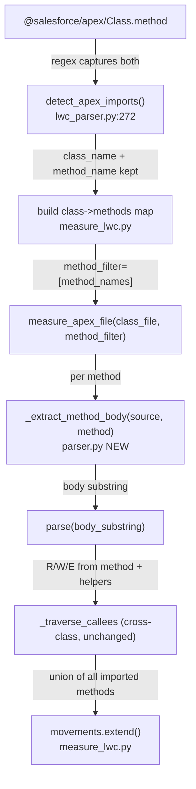

# LWC Apex Method-Scoped Traversal Fix

## Problem

When the LWC measurer sees `@salesforce/apex/WorkOrderLineItemTableController.submitForApproval`, it captures both `class_name` and `method_name` but then **discards `method_name`** and measures the entire class. This produces false-positive movements from methods the LWC never calls (e.g. `getRecords` appearing as DM 1, `updateRecords` as DM 21).

## Root cause

Two separate problems share the same fix surface:

- **Problem A** — `_method_name` discarded at `measure_lwc.py:252`; `measure_apex_file` called with no method scope, so `parse()` runs on the entire class source
- **Problem B** — intra-class private helpers called from an imported method must still be included; a naive line-range filter on `find_reads`/`find_writes` would miss them

## Approach chosen

Extract the **method body as a source substring** for each imported method, run `parse()` on that substring, then seed the existing `_traverse_callees` cross-class recursion with those movements. This:

- Excludes unrelated `@AuraEnabled` methods in the same class (fixes Problem A)
- Includes intra-class private helpers because `_traverse_callees` still follows call-graph edges from within the extracted body (fixes Problem B)
- Requires no changes to `find_reads` / `find_writes` / `find_exits`

## Flow after fix



## Key files

- [`measure_lwc.py`](.cursor/skills/cosmic-measurer/cosmic-lwc-measurer/scripts/measure_lwc.py) — `_method_name` discarded at line 252; `measure_apex_file` call at line 261
- [`measure_apex.py`](.cursor/skills/cosmic-measurer/cosmic-apex-measurer/scripts/measure_apex.py) — `measure_file()` at line 149; `_traverse_callees` at line 79
- [`parser.py`](.cursor/skills/cosmic-measurer/cosmic-apex-measurer/scripts/parser.py) — `parse()` at line 998; `_get_method_boundaries()` at line 903; brace-depth body extraction pattern already in `_get_batch_call_order` at line 924

## Changes

### 1. `parser.py` — add `_extract_method_body(source, method_name) -> str | None`

Reuse the brace-depth extraction already in `_get_batch_call_order` (lines 950–958). Return the source substring from the opening `{` to the matching closing `}`, or `None` if the method is not found.

```python
def _extract_method_body(source: str, method_name: str) -> Optional[str]:
    for m in METHOD_SIGNATURE.finditer(source):
        if m.group(2) == method_name:
            brace = source.find("{", m.start())
            depth, end = 1, brace + 1
            while depth and end < len(source):
                if source[end] == "{": depth += 1
                elif source[end] == "}": depth -= 1
                end += 1
            return source[brace:end]
    return None
```

### 2. `measure_apex.py` — add `method_filter: list[str] | None` to `measure_file`

When `method_filter` is set:
- For each method name, call `_extract_method_body`; if not found, add to `traversalWarnings`
- Run `parse(body_substring)` on each body and union all movements
- Feed that union into `_traverse_callees` as the seed (cross-class expansion unchanged)

When `method_filter` is `None`, behaviour is identical to today (full-class parse).

```python
def measure_file(path, fp_id, *, method_filter=None, entry_param_filter=None, ...):
    source = path.read_text(...)
    if method_filter:
        all_movements = []
        for method_name in method_filter:
            body = _extract_method_body(source, method_name)
            if body is None:
                warnings.append(f"Method not found: {method_name} in {path.name}")
                continue
            _, movements = parse(body)
            all_movements.extend(movements)
    else:
        _, all_movements = parse(source, entry_param_filter=entry_param_filter)
    # _traverse_callees seeded with all_movements as before
```

### 3. `measure_lwc.py` — collect all method names per class, pass as `method_filter`

```python
# Build: class_name -> [method_names]
class_methods: dict[str, list[str]] = {}
for class_name, method_name in imports:
    class_methods.setdefault(class_name, []).append(method_name)

for class_name, method_names in class_methods.items():
    class_file = find_class_file(class_name, search_paths)
    if class_file is None:
        warnings.append(f"Unable to resolve Apex class: {class_name}")
        continue
    apex_output = measure_apex_file(
        class_file, fp_id,
        method_filter=method_names,
        search_paths=search_paths,
        traverse=True,
    )
    movements.extend(_apex_rows_to_raw_movements(...))
```

One call per class (not per method) — all imported methods from the same class are resolved in a single pass.

### Edge cases

- Method not found in class → `traversalWarning`, not a hard failure
- Same movement deduplicated across multiple imported methods from the same class (union by `sourceLine + movement_type + data_group`)
- `_traverse_callees` unchanged — cross-class expansion still runs from the unioned seed

## Regression tests

- Add `expected/AddSORs.lwc.expected.json` asserting `getRecords`-sourced and `updateRecords`-sourced movements are absent
- Existing `expected/cfp_FunctionalProcessVisualiser.lwc.expected.json` must pass unchanged
