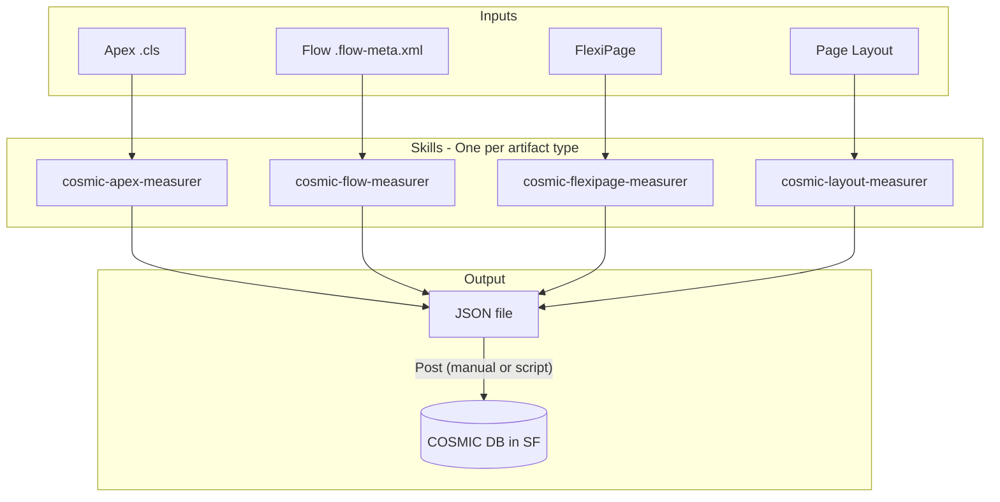

# COSMIC Measurer Skills - Implementation Plan

## Context

- **COSMIC data movements**: Entry (E), Exit (X), Read (R), Write (W) — one CFP per movement of a data group
- **Target**: JSON file for posting to COSMIC database (cfp_Data_Movements__c and related objects)
- **Assumptions**: JSON schema inferred from existing objects; Data Groups mapped by Salesforce object API name; Functional Process created manually in org; skill attaches data movements to existing FP

---

## SKILL.md contract (all artifact skills)

Every artifact skill (`cosmic-apex-measurer`, `cosmic-flow-measurer`, `cosmic-flexipage-measurer`, `cosmic-layout-measurer`, …) must satisfy:

1. **YAML frontmatter**
  - `name` — must match the skill folder name exactly (e.g. `cosmic-apex-measurer`).
    - `description` — ≤100 words, outcome-first, COSMIC/Salesforce domain keywords, and trigger phrases (e.g. “measure Apex for COSMIC”, “data movements E/R/X/W”, “functional size”).
    - **Optional** when stable: `metadata.category` (e.g. Salesforce, COSMIC), `metadata.version`; `license` / `compatibility` if needed — see [skill-best-practices.md](../../skill-best-practices.md).
2. **Body sections** — Markdown `##` headings in this order: **Goal**, **Workflow**, **Validation**, **Output** (final artifact definition). Supporting detail may live in `reference.md`, `docs/`, or `examples/` per progressive disclosure.
3. **Canonical FP exit** — Every measured functional process must **append** one final **X**: `**Errors/notifications`** (`dataGroupRef`: `User`, last `order`), after any artifact-specific movements (including parser `return` exits for Apex). See [reference.md](../skills/cosmic-measurer/reference.md) § Canonical FP exit. Apex implements this in `movements.py` `build_output`; other artifact skills must match the same appended row (adjust `implementationType` per artifact).

**Folder naming:** This project uses the suffix `*-measurer` (not gerund `*-measuring`) for product consistency; `[skill-best-practices.md](../../skill-best-practices.md)` prefers gerund `-ing` — **we document that exception here**; `name` in frontmatter still matches the folder exactly.

---

## Target JSON Structure (inferred from samples)

From [samples/cfp_createCRUDLwithRelatedLists.flow-meta.xml](samples/cfp_createCRUDLwithRelatedLists.flow-meta.xml) and [samples/cfp_getDataMovements.cls](samples/cfp_getDataMovements.cls):

```json
{
  "functionalProcessId": "<Id>",
  "artifact": { "type": "Apex|Flow|FlexiPage|PageLayout", "name": "..." },
  "dataMovements": [
    {
      "name": "Read Account list",
      "order": 1,
      "movementType": "R",
      "dataGroupRef": "Account",
      "implementationType": "apex|ootb|config|Flexipage|listview",
      "isApiCall": false
    }
  ]
}
```

**Note**: `dataGroupRef` may be object API name or cfp_DataGroups__c Id depending on API; resolution can be done at post time.

---

## Architecture




---

## Test Cases (samples/)

Use artifacts in [samples/](samples/) as test cases for each skill. Generated output must be validated against expected results.


| Artifact      | Path                                                                                                                                                   | Use for              |
| ------------- | ------------------------------------------------------------------------------------------------------------------------------------------------------ | -------------------- |
| Apex (simple) | [samples/cfp_getDataMovements.cls](samples/cfp_getDataMovements.cls)                                                                                   | cosmic-apex-measurer |
| Apex (batch)  | [samples/BulkSurveyActionsBatch.cls](samples/BulkSurveyActionsBatch.cls), [samples/dk_PASSurveyToAssetBatch.cls](samples/dk_PASSurveyToAssetBatch.cls) | cosmic-apex-measurer |
| Flow          | [samples/cfp_createCRUDLwithRelatedLists.flow-meta.xml](samples/cfp_createCRUDLwithRelatedLists.flow-meta.xml)                                         | cosmic-flow-measurer |
| FlexiPage     | Add sample (for example, `samples/Account_Record_Page.flexipage-meta.xml`) in Phase 4                                                                  | cosmic-flexipage-measurer |
| Page Layout   | Add sample layout metadata XML in Phase 5                                                                                                                | cosmic-layout-measurer |


**Workflow**: For each phase, run the skill against the corresponding sample, produce JSON, and verify the output matches expected data movements. Add FlexiPage and Page Layout samples when their phases start if not present.

**Expected outputs** (golden files): Store expected JSON in `samples/expected/` (e.g., `cfp_getDataMovements.expected.json`, `cfp_createCRUDLwithRelatedLists.expected.json`) for regression testing.

---

## Phase 1: Foundation (shared across all skills)

**Chat 1 – Foundation**

1. **Create shared reference**
  - [.cursor/skills/cosmic-measurer/reference.md](.cursor/skills/cosmic-measurer/reference.md): COSMIC E/R/X/W definitions, mapping rules, JSON schema
    - Canonical JSON schema (fields, types, required vs optional)
2. **Data Group mapping config**
  - File or section listing standard object → Data Group mapping (e.g., Account, Contact, custom objects)
    - How to handle unknown objects (placeholder, skip, or flag)
3. **JSON output template**
  - Single file format that all skills produce
    - Validation rules (e.g., movementType in [E,R,X,W])
4. **SKILL.md contract baked into docs**
  - Ensure [SKILL.md contract](#skillmd-contract-all-artifact-skills) (above) is reflected in `reference.md` or a short `docs/skill-template-notes.md` pointer to [skill-best-practices.md](../../skill-best-practices.md)
    - Acceptance: future Phases 2–4 `SKILL.md` files are reviewed against Goal / Workflow / Validation / Output and frontmatter rules before closing each chat

---

## Phase 2: Apex Measurer

**Chat 2 – Apex skill**

1. **Create** [.cursor/skills/cosmic-measurer/cosmic-apex-measurer/SKILL.md](.cursor/skills/cosmic-measurer/cosmic-apex-measurer/SKILL.md) satisfying the [SKILL.md contract](#skillmd-contract-all-artifact-skills) (Goal, Workflow, Validation, Output; `name` + `description` frontmatter).
2. **Inspection rules** (simple Apex first):
  - **Read (R)**: `[SELECT ... FROM ObjectName ...]`, `Database.getQueryLocator`, `Database.query`
    - **Write (W)**: `insert`, `update`, `upsert`, `delete`, `Database.`* DML
    - **Entry (E)**: Method parameters (e.g., `@AuraEnabled` params, `@InvocableVariable`)
    - **Exit (X)**: `return` of data to caller
3. **Scope**: Single class, **single entry point**; no triggers, no chained calls
4. **Entry-point identification** (refined):
  - **Batch** (`implements Database.Batchable`): Entry from constructor params + static factories (e.g. `forSurveys`); Exit = none (execute returns void)
    - **Simple**: Entry/Exit only from first `@AuraEnabled` / `@InvocableMethod` or first public static method
    - **Exclude**: Helper method params/returns; primitive config (String, Integer, Boolean); Map/Set params (don't infer from param name)
5. **Python script**: Deterministic `measure_apex.py` for automation; run tests via `test_measure_apex.py`
6. **Output**: JSON with `artifact.type: "Apex"`, `artifact.name: "<ClassName>"`, ordered data movements
7. **Test**: Run against [samples/cfp_getDataMovements.cls](samples/cfp_getDataMovements.cls) — expect 1 E, 1 R, 1 X. Also [samples/BulkSurveyActionsBatch.cls](samples/BulkSurveyActionsBatch.cls), [samples/dk_PASSurveyToAssetBatch.cls](samples/dk_PASSurveyToAssetBatch.cls) for batch regression

---

## Phase 3: Flow Measurer

**Chat 3 – Flow skill**

1. **Create** [.cursor/skills/cosmic-measurer/cosmic-flow-measurer/SKILL.md](.cursor/skills/cosmic-measurer/cosmic-flow-measurer/SKILL.md) satisfying the [SKILL.md contract](#skillmd-contract-all-artifact-skills).
2. **Inspection rules** (from flow-meta.xml):
  - **Read (R)**: `recordLookups`, `getRecords` (include object type where present)
    - **Write (W)**: `recordCreates`, `recordUpdates`, `recordDeletes`
    - **Entry (E)**: Screen inputs, variables from start
    - **Exit (X)**: Display elements, screen outputs, return values
3. **Leverage** [samples/cfp_createCRUDLwithRelatedLists.flow-meta.xml](samples/cfp_createCRUDLwithRelatedLists.flow-meta.xml) patterns (assignments with cfp_movementtype__c, cfp_DataGroups__c)
4. **Output**: Same JSON format; `artifact.type: "Flow"`, `artifact.name: "<FlowApiName>"`
5. **Test**: Run against [samples/cfp_createCRUDLwithRelatedLists.flow-meta.xml](samples/cfp_createCRUDLwithRelatedLists.flow-meta.xml) — validate extracted movements match flow structure

---

## Phase 4: FlexiPage Measurer

**Chat 4 - FlexiPage skill**

1. **Create** [.cursor/skills/cosmic-measurer/cosmic-flexipage-measurer/SKILL.md](.cursor/skills/cosmic-measurer/cosmic-flexipage-measurer/SKILL.md) satisfying the [SKILL.md contract](#skillmd-contract-all-artifact-skills).
2. **Inspection rules** (from FlexiPage metadata XML):
  - **Exit (X)**: Visible components and bound record fields rendered to users
    - **Entry (E)**: User inputs on interactive components where metadata indicates editable interaction (for example, quick action regions or editable related components)
    - **Read (R)**: Data-bound components that require server fetches implied by record context, related lists, or list views
    - **Write (W)**: Usually none at metadata level unless component config clearly implies direct write action
3. **Input**: FlexiPage metadata XML
4. **Output**: Same JSON format; `artifact.type: "FlexiPage"`
5. **Test**: Add sample FlexiPage to [samples/](samples/) when implementing; validate output

---

## Phase 5: Page Layout Measurer

**Chat 5 - Page Layout skill**

1. **Create** [.cursor/skills/cosmic-measurer/cosmic-layout-measurer/SKILL.md](.cursor/skills/cosmic-measurer/cosmic-layout-measurer/SKILL.md) satisfying the [SKILL.md contract](#skillmd-contract-all-artifact-skills).
2. **Inspection rules**:
  - **Exit (X)**: Fields/sections on layout = data displayed to user
    - **Entry (E)**: Editable fields (if layout implies create/edit)
    - Read/Write: Typically none (layout is presentation)
3. **Input**: Page layout metadata XML
4. **Output**: Same JSON format; `artifact.type: "PageLayout"`
5. **Test**: Add sample layout to [samples/](samples/) when implementing; validate output

---

## Phase 6: Extensions (later chats)

- **Chat 6**: Triggers, queueable (chained Apex). *Note: Basic batch (constructor + execute scope) already in Phase 2.*
- **Chat 7**: LWC, Aura (frontend -> backend)
- **Chat 8**: Validation rules, formula fields (if in scope)
- **Chat 9**: Post script/CLI to push JSON to org (optional)

---

## File Structure (final)

```
.cursor/skills/cosmic-measurer/
├── reference.md           # COSMIC definitions, JSON schema, mapping rules
├── cosmic-apex-measurer/
│   ├── SKILL.md           # Goal, Workflow, Validation, Output (+ frontmatter per contract)
│   ├── PYTHON_DESIGN.md   # Parser design, regex strategy
│   ├── scripts/           # Deterministic measurement
│   │   ├── measure_apex.py
│   │   ├── parser.py
│   │   └── movements.py
│   └── tests/
│       └── test_measure_apex.py
├── cosmic-flow-measurer/
│   └── SKILL.md
├── cosmic-flexipage-measurer/
│   └── SKILL.md
├── cosmic-layout-measurer/
│   └── SKILL.md
└── examples/
    ├── apex-sample.json
    ├── flow-sample.json
    ├── flexipage-sample.json
    └── layout-sample.json

samples/                   # Test case artifacts
├── cfp_getDataMovements.cls
├── BulkSurveyActionsBatch.cls
├── dk_PASSurveyToAssetBatch.cls
├── cfp_createCRUDLwithRelatedLists.flow-meta.xml
└── expected/              # Golden JSON outputs for regression
    ├── cfp_getDataMovements.expected.json
    └── cfp_createCRUDLwithRelatedLists.expected.json
```

---

## Open Points for Later Chats

1. **Data Group ID resolution**: JSON may use object API name; posting logic (in org or script) resolves to cfp_DataGroups__c Id
2. **Ordering**: `cfp_order__c` — deterministic ordering rules per artifact type
3. **implementationType**: Apex vs ootb vs config — criteria for classification
4. **Posting mechanism**: Manual copy, sf CLI script, or Apex REST endpoint — to be decided
5. **Dynamic SOQL**: `Database.getQueryLocator(queryString)` with string concatenation — object not detectable via regex; consider heuristics (e.g. scan for `FROM ObjectName` in string literals)

---

## Suggested Chat Sequence


| Chat | Focus       | Deliverable                                                                                                                                   |
| ---- | ----------- | --------------------------------------------------------------------------------------------------------------------------------------------- |
| 1    | Foundation  | reference.md, JSON schema, mapping config; SKILL contract reflected in docs; link to [skill-best-practices.md](../../skill-best-practices.md) |
| 2    | Apex        | cosmic-apex-measurer `SKILL.md` (Goal, Workflow, Validation, Output + frontmatter) + apex-sample.json                                         |
| 3    | Flow        | cosmic-flow-measurer `SKILL.md` (same section contract) + flow-sample.json                                                                    |
| 4    | FlexiPage   | cosmic-flexipage-measurer `SKILL.md` (same section contract) + flexipage-sample.json                                                         |
| 5    | Page Layout | cosmic-layout-measurer `SKILL.md` (same section contract) + layout-sample.json                                                                |
| 6+   | Extensions  | Triggers, LWC, posting script, etc.                                                                                                           |


