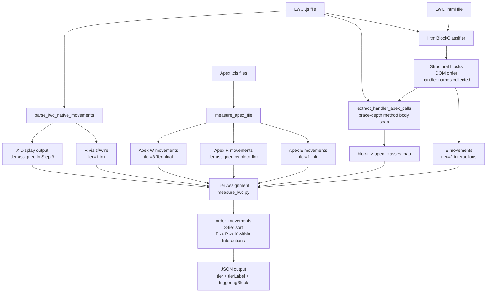

# COSMIC Counting Rules

This document captures the counting behavior implemented in the Python measurers so COSMIC measurers can apply the same rules consistently.

## Scope

Applies to:

- Apex measurer
- Flow measurer
- FlexiPage measurer
- LWC measurer
- Shared output ordering/dedup logic

Implementation sources live under `.cursor/skills/cosmic-measurer/`.

## Global Rules (all artifacts)

- **Canonical final exit is always appended**:
  - `name`: `Errors/notifications`
  - `movementType`: `X`
  - `dataGroupRef`: `status/errors/etc`
- **Functional size (CFP)** is computed from emitted rows: `E + R + W + X`.
- **Ordering is deterministic**:
  - type-first order: `E`, `R`, `W`, `X`
  - then execution/order hints and source line tie-breakers.
- **Read dedup**: same `R` with same `dataGroupRef` and `name` is counted once.
- **Write merge**: multiple `W` rows for the same `dataGroupRef` are counted as one `W` row, with additional operations stored in `mergedFrom`.
- `isApiCall` is currently emitted as `false` for measured rows.

## Apex Rules

### Entry (`E`)

- Count entry parameters from detected entry-point methods:
  - `@AuraEnabled` / `@InvocableMethod` method
  - batch constructor and batch factory methods
  - fallback to first public static method when needed
- Filter out framework/context and primitive-only inputs.
- Optional `--entry-point <param>` limits counting to one process parameter.

### Read (`R`)

- Count SOQL reads from inline SOQL, `Database.query(...)`, and `Database.getQueryLocator(...)`.
- For record-type filtered queries, `dataGroupRef` can be:
  - `Object::DeveloperName` (resolved)
  - `Object::unknown RT` (record type present but unresolved)
  - `Object` (no record type discrimination)
- **`RecordType` object reads are excluded from CFP** and reported separately in `recordTypeReadsExcludedFromCfp`.

### Write (`W`)

- Count DML statements and database DML methods (`insert`, `update`, `upsert`, `delete`).
- Count `EventBus.publish(...)` as `W` when target object can be inferred.
- Multiple writes to the same `dataGroupRef` collapse to one counted `W`.

### Exit (`X`)

- Non-batch: count return-based exits from entry-point method return types (excluding primitive/framework/internal map-set returns).
- Batch classes: parser-derived exits are not counted.
- Canonical final exit is always appended.

### Traversal

- By default, called class traversal is enabled for static calls and async handoffs (`executeBatch`, `enqueueJob`, `schedule`) when class files resolve.
- Traversed movements are tagged via `viaArtifact`; unresolved classes appear in `calledClassesNotFound`.
- Traversal contributes `R/W` movements from callees.

## Flow Rules

### Entry (`E`)

- Count trigger entry for record-triggered flows (`start.object` + trigger context).
- Count SObject input variables (`isInput=true` with object type).
- Special handling for `recordId`: infer object from first `recordLookup` filtered on `Id = {!recordId}`.

### Read (`R`)

- Count each `recordLookups` element as an `R`.

### Write (`W`)

- Count `recordCreates`, `recordUpdates`, `recordDeletes`.
- Resolve object from element object value, else from input reference variable object type, else `Unknown`.

### Exit (`X`)

- Count SObject output variables (`isOutput=true` with object type).
- Add screen-display exits from screen analysis.
- Canonical final exit is always appended.

### Screen movement rules

- Input-like screen fields contribute `E`.
- Display/component screen fields contribute `X`.
- Per screen, distinct data groups are counted once per movement direction.

### Invocable Apex integration

- `actionCalls` with `actionType=apex` are resolved and measured via Apex measurer.
- Apex canonical synthetic exit is not imported as-is; Flow appends its own canonical final exit.
- Imported rows are tagged with `viaArtifact` and set to `implementationType: apex`.
- Missing classes are reported in `invocableApexClassesNotFound`/`traversalWarnings`.

## LWC Rules

LWC uses a **3-tier ordering model** (Init → Interactions → Terminal) rather than a flat `E → R → W → X` sequence. HTML is parsed into structural blocks; each block emits a semantically named `E` movement. Apex R movements are linked to blocks via a JS handler → Apex call graph, and assigned to Init or Interactions accordingly. W movements and the canonical X always appear last.

See [COUNTING_RULES_LWC.md](COUNTING_RULES_LWC.md) for full detail on block classification, tier assignment, and ordering rules.

## FlexiPage Rules

### Base extraction

- Record page configuration is parsed to extract page-level movement candidates.
- Highlights, related lists, related records, path components, and tab bindings can contribute movements.

### Tab-bound traversal

- Tab-bound LWC and Flow components can be resolved and merged into page-level output.
- Resolved rows may be tab-suffixed in names for traceability.

### Ordering and dedup in final output

- Page-level output is post-processed to promote key record interactions into stable order.
- Canonical final exit is re-appended at the end after merge/reorder stages.
- Final dedup (enabled by default) removes repeated non-canonical rows by:
  - `movementType`
  - `dataGroupRef`
  - normalized `name` (tab suffix removed before dedup keying)
- `--no-dedupe-movements` disables this final dedup pass.

## Practical counting guidance

- Treat this file as the implementation authority for tooling-produced CFP.
- If a modeling decision conflicts with generic COSMIC interpretation, prefer the scripted rule for consistency unless and until the script is changed.
- When reporting results, include notes on:
  - merged writes
  - traversal-derived rows (`viaArtifact`)
  - exclusions (for example `RecordType` reads in Apex)
  - canonical final exit behavior
